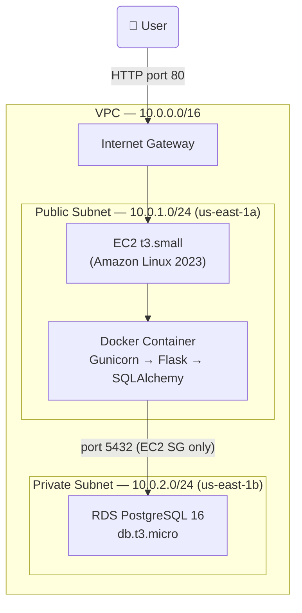

# Resonate 🌿

**Your AI-powered journaling companion.**

---

## Features

- **Distraction-free writing** — A clean, minimalist interface for capturing your thoughts without clutter.
- **Mood tracking** — Tag entries with emotions using our Emerald green and pastel chip UI. Select multiple moods per entry to capture how you're really feeling.
- **AI Insights** — Each entry gets an empathetic analysis and personalized **music curation** powered by AI. Discover songs that match your vibe.
- **Chat with Camus** — A floating chat assistant that reflects on your journal history, recommends books, and answers questions using your own words.
- **Safety routing** — Dedicated crisis and toxic content detection. Entries flagged for self-harm or hate speech are routed to supportive resources or blocked—never saved—keeping Resonate a safe space for reflection.

---

## Tech Stack

- **Backend:** Flask + Gunicorn
- **Frontend:** Alpine.js, Tailwind CSS, DaisyUI
- **Database:** PostgreSQL 16 (AWS RDS, via Flask-SQLAlchemy) + ChromaDB (vector embeddings for journal memory search)
- **AI Integration:** OpenAI (summaries, security, embeddings), Google Gemini (music recommendations), Tavily (web search for chat)
- **Infrastructure:** AWS (EC2 + RDS + VPC), Docker, Terraform

---

## Project Structure

```
Resonate-App/
├── app/
│   ├── __init__.py                           # Flask app factory, db init, blueprint registration
│   ├── database.py                           # SQLAlchemy models (User, JournalEntry, Mood, Song, Recommendation)
│   ├── routes.py                             # All Flask routes (profile, journal, chat, crisis/toxic redirects)
│   ├── services/                             # Business logic & AI agents
│   │   ├── ai_chatbox_agent.py               # Chat bot (LangChain + Tavily web search)
│   │   ├── ai_entry_summary_agent.py         # Empathetic journal analysis (OpenAI)
│   │   ├── ai_library_agent.py               # Book recommendations
│   │   ├── ai_music_recommendation_agent.py  # Music curation (Google Gemini)
│   │   ├── ai_security_agent.py              # Content safety classifier (OpenAI) — crisis/toxic detection
│   │   ├── ai_judge_agent.py                 # Quality validation for recommendations
│   │   ├── journal_services.py               # Journal CRUD, entry creation flow
│   │   ├── past_recommendation_service.py    # Anti-repetition, recommendation history
│   │   ├── user_service.py                   # User CRUD
│   │   ├── vector_engine.py                  # ChromaDB embeddings for journal memory search
│   │   └── tools.py                          # LangChain tools (search_journal_memory, consult_librarian)
│   └── templates/                            # Jinja2 + Tailwind + DaisyUI
│       ├── layout.html                       # Master layout, navbar, chat bubble, footer
│       ├── index.html                        # Login / profile selector
│       ├── create_profile.html               # Onboarding form
│       ├── profile.html                      # Dashboard, journal history, "Write Entry" CTA
│       ├── journal.html                      # New entry form, mood chips, textarea
│       ├── edit_entry.html                   # Edit existing entry
│       ├── entry_detail.html                 # View entry, AI insights, music card
│       ├── crisis.html                       # Safety page — crisis resources (no nav links)
│       └── toxic.html                        # Safety page — content blocked (no nav links)
├── terraform/                                # Infrastructure as Code (Terraform)
│   ├── main.tf                               # All AWS resources (VPC, subnets, SGs, RDS, EC2)
│   ├── variables.tf                          # Input variables (db_password)
│   └── outputs.tf                            # Outputs (EC2 IP, RDS endpoint)
├── run.py                                    # Entry point, dev server
├── setup_db.py                               # DB init, seed moods
├── Dockerfile                                # Container image definition
├── requirements.txt
├── .env                                      # API keys (not in repo)
└── chroma_db/                                # ChromaDB vector store (created at runtime)
```

---

## Local Setup

### 1. Clone the repository

```bash
git clone https://github.com/your-username/Resonate-App.git
cd Resonate-App
```

### 2. Create a virtual environment (recommended)

```bash
python -m venv venv
source venv/bin/activate   # On Windows: venv\Scripts\activate
```

### 3. Install dependencies

```bash
pip install -r requirements.txt
```

### 4. Environment variables

Create a `.env` file in the project root with your API keys:

```
OPENAI_API_KEY=your_openai_key
GEMINI_API_KEY=your_gemini_key
TAVILY_API_KEY=your_tavily_key
LANGFUSE_SECRET_KEY=your_langfuse_key
LANGFUSE_PUBLIC_KEY=your_langfuse_public_key
```

### 5. Initialize the database

```bash
python setup_db.py
```

### 6. Run the app

```bash
python run.py
```

Open [http://127.0.0.1:5000/](http://127.0.0.1:5000/) in your browser.

---

## Cloud Deployment (AWS)

Resonate is deployed on AWS in `us-east-1` using EC2, RDS PostgreSQL, and a custom VPC — all provisioned with Terraform and containerised with Docker.

**Live app:** http://32.196.130.174

---

### Architecture



---

### Infrastructure at a Glance

| Service | Config | Purpose |
|---|---|---|
| EC2 | `t3.small`, Amazon Linux 2023 | Runs the Docker container |
| RDS | PostgreSQL 16, `db.t3.micro`, 20 GB | Managed relational database |
| VPC | `10.0.0.0/16` | Isolated private network |
| Public Subnet | `10.0.1.0/24`, `us-east-1a` | EC2 — internet-facing |
| Private Subnet | `10.0.2.0/24`, `us-east-1b` | RDS — no public internet access |
| Security Groups | Port 80/22 for EC2; port 5432 (EC2 SG only) for RDS | Firewall rules |

**Key security decision:** The RDS instance is in a private subnet with `publicly_accessible = false`. Port 5432 is open only to the EC2 security group — not to the internet.

→ See [AWS Deployment Guide](AWS_DEPLOYMENT_GUIDE.md) for the full architecture walkthrough, Terraform setup, deployment commands, and lessons learned.

---

## Visuals


